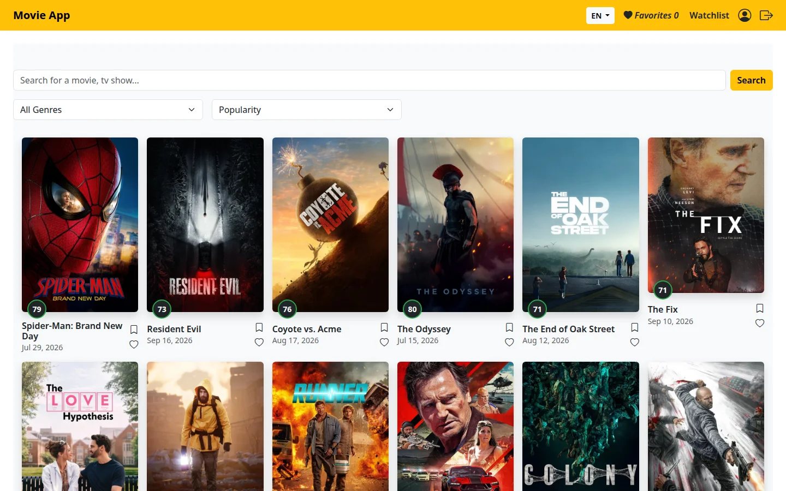
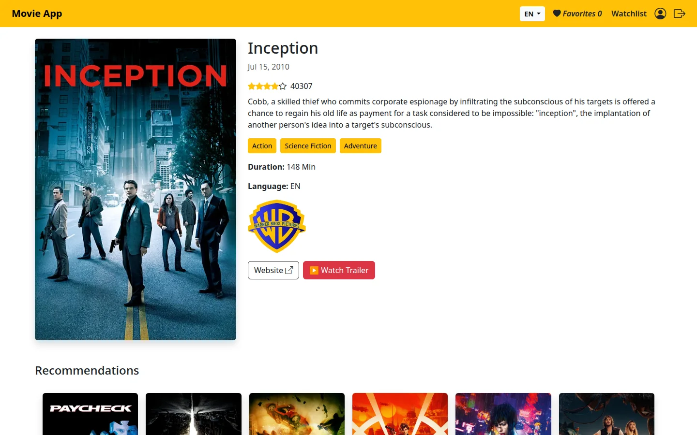
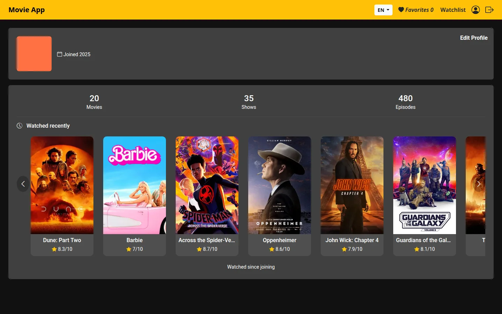
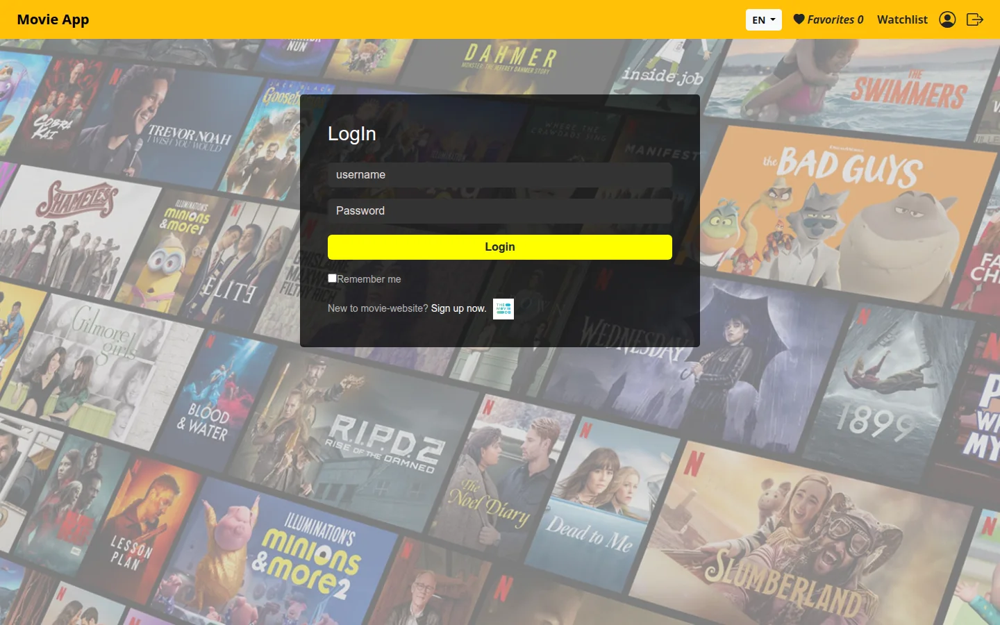
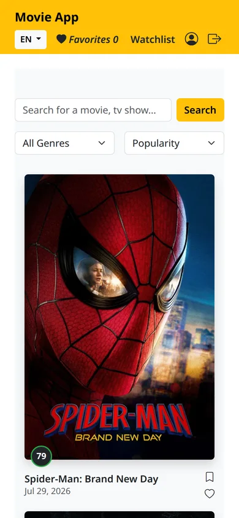

# Movie App

A movie discovery app built with **Angular 20** on top of [The Movie Database (TMDB)](https://www.themoviedb.org/) API: browse and search films, open a details page with recommendations, and keep favorites and a watchlist on your TMDB account.

**[Live demo →](https://montaser-hub.github.io/movie-website/search)**

> **Team project.** Built by five people as an ITI training project. This repository is my copy of the team's work, with the full commit history and everyone's authorship preserved. See [Team](#team) for who built what.



| Movie details and recommendations | Account page |
| --- | --- |
|  |  |

 

## Features

- **Browse and search** movies with a genre filter, sort options and pagination. Press Enter or the button to search.
- **Movie details:** rating, genres, duration, production companies, trailer link and recommendations.
- **Favorites and watchlist**, saved to your TMDB account.
- **Sign in with TMDB:** the app creates a TMDB session from your TMDB username and password.
- **Account pages:** profile details and an edit-profile form with validation.
- **Two languages:** switch between English and Arabic from the header.
- **Responsive** Bootstrap 5 layout with skeleton loaders while data loads.

## Team

| Area | Built by |
| --- | --- |
| Account details, edit profile, favorites page, footer with pagination, language switching, search pagination, PR review and merging | **Montaser Ismail** |
| Login, HTTP service, project setup | Mohamed Mahmoud |
| Main page, search page, movie cards | Omar Ali |
| Movie details | Hazem Hefny |
| Watchlist | Sherok Mohamed |

Many files were touched by more than one person; `git log` and `git blame` have the exact picture.

## Tech

Angular 20 (standalone components, router, forms) · TypeScript · RxJS · Bootstrap 5 and Bootstrap Icons · TMDB REST API · Jasmine and Karma

## Run locally

Requirements: Node.js 20.19+ or 22.12+.

```bash
git clone https://github.com/montaser-hub/movie-website.git
cd movie-website
npm ci
npm start          # http://localhost:4200
```

### TMDB API key

The key lives in [`src/environments/environment.ts`](src/environments/environment.ts). TMDB keys are free: create one under *Settings → API* in your TMDB account and replace the value there. A browser app can't hide this key, because it is sent with every request, so use a key from an account made for this app.

## Deployment

```bash
npm run deploy
```

[`scripts/deploy.sh`](scripts/deploy.sh) builds the app with the `/movie-website/` base path and pushes the result to the `gh-pages` branch, which GitHub Pages serves. It copies `index.html` to `404.html` so deep links such as `/details/27205` keep working after a refresh.

## Project structure

```
src/app/component/   pages and UI pieces (search, details, account, wishlist, header, footer…)
src/app/services/    TMDB HTTP service, account, language and shared state
src/app/models/      movie and user types
src/environments/    API settings
```

## Credits

Movie data and images come from [TMDB](https://www.themoviedb.org/). This product uses the TMDB API but is not endorsed or certified by TMDB.
